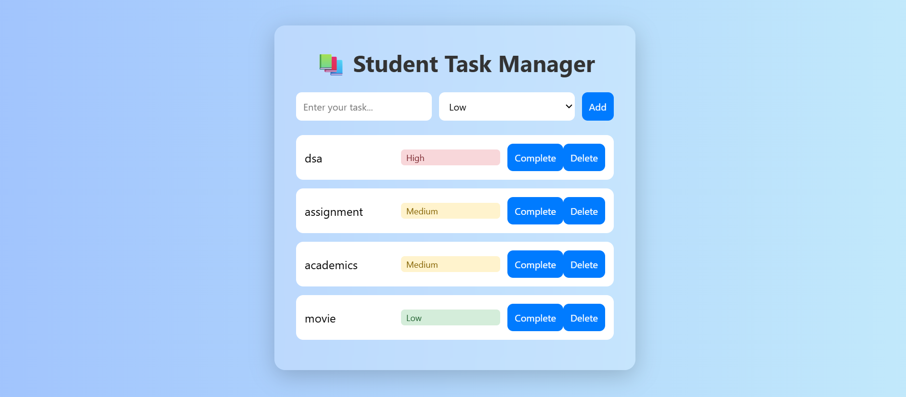

# 🎓 Student Task Manager V2

A simple yet powerful task manager built for students to track assignments, backlogs, and goals.

## 🔧 Tech Stack

- HTML
- CSS
- JavaScript
- localStorage

## 🚀 Features

- Add, complete, and delete tasks
- Prioritize tasks with **Low / Medium / High** badges
- Data persists using browser localStorage
- Responsive UI

## 🌐 Live Link

🔗 [Click here to view live](https://nishant-singh-sogarwal.github.io/student-task-manager)

## 📷 Preview

 <!-- Add this if you have screenshot -->
